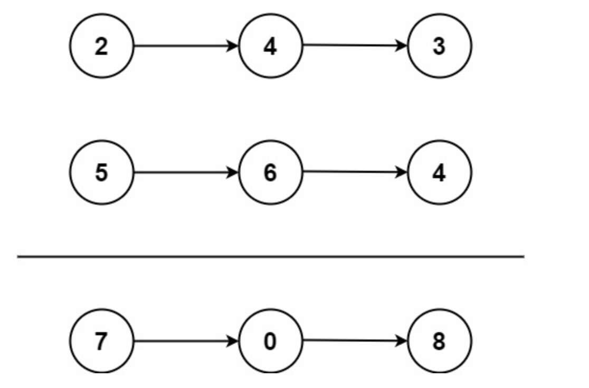

## 2. Add Two Numbers

You are given two non-empty linked lists representing two non-negative integers. The digits are stored in reverse order, and each of their nodes contains a single digit. Add the two numbers and return the sum as a linked list.

You may assume the two numbers do not contain any leading zero, except the number 0 itself.

Example 1\


Input: l1 = [2,4,3], l2 = [5,6,4]\
Output: [7,0,8]\
Explanation: 342 + 465 = 807.

Example 2:\
Input: l1 = [0], l2 = [0]\
Output: [0]

Example 3:\
Input: l1 = [9,9,9,9,9,9,9], l2 = [9,9,9,9]\
Output: [8,9,9,9,0,0,0,1]

### gpt建議:
- 利用虛擬頭節點
- 最大如果有進位，增加節點

```python
# Definition for singly-linked list.
# class ListNode:
#     def __init__(self, val=0, next=None):
#         self.val = val
#         self.next = next
class Solution:
    def addTwoNumbers(self, l1: Optional[ListNode], l2: Optional[ListNode]) -> Optional[ListNode]:
        # 創建虛擬頭節點
        dummyHead = ListNode(0)
        # 將指針指向虛擬頭
        current = dummyHead
        # 初始化進位
        carry = 0
        # 計算l1,l2節點相加值
        while l1 or l2:
            if l1:
                x = l1.val
            else:
                x = 0
            if l2:
                y = l2.val
            else:
                y = 0
            
            sum = carry + x + y
            carry = sum // 10
            # 將計算出得值放入創建的節點
            current.next = ListNode(sum % 10)
            # 更新指針位置
            current = current.next

            # 前往l1,l2下一的節點
            if l1:
                l1 = l1.next
            if l2:
                l2 = l2.next
        if carry > 0:
            current.next = ListNode(carry)

        return dummyHead.next
```
