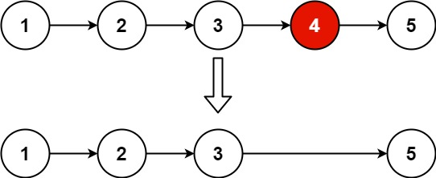

## 19. Remove Nth Node From End of List(med.)

Given the head of a linked list, remove the nth node from the end of the list and return its head.

Example 1:\

Input: head = [1,2,3,4,5], n = 2\
Output: [1,2,3,5]

Example 2:\
Input: head = [1], n = 1\
Output: []

Example 3:\
Input: head = [1,2], n = 1\
Output: [1]

### gpt建議:
- 使用雙指針
- 快的指針指向最後一個節點的next(None)
- 面指針指向要被移除的前一個
- 兩個指針相差`n+1`


```python
# Definition for singly-linked list.
# class ListNode:
#     def __init__(self, val=0, next=None):
#         self.val = val
#         self.next = next
class Solution:
    def removeNthFromEnd(self, head: Optional[ListNode], n: int) -> Optional[ListNode]:
        # 創建虛擬頭節點（如果要刪除的是第一個節點）
        dummy = ListNode(0)
        dummy.next = head
        # 初始化指針 slow、fast 。
        slow = dummy
        fast = dummy
        # slow 與 fast 相距 n 步，slow為被刪除的前一個(寫進 while 迴圈裡)
        for i in range(n+1):
                fast = fast.next        
        while fast:
            fast = fast.next
            slow = slow.next
        slow.next = slow.next.next

        return dummy.next
```