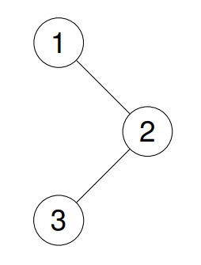

## 94. Binary Tree Inorder Traversal

Given the root of a binary tree, return the inorder traversal of its nodes' values.

Example 1:\
Input: root = [1,null,2,3]\
Output: [1,3,2]\
Explanation:


Example 2:\
Input: root = [1,2,3,4,5,null,8,null,null,6,7,9]\
Output: [4,2,6,5,7,1,3,9,8]\
Explanation:


Example 3:\
Input: root = []\
Output: []

Example 4:
Input: root = [1]
Output: [1]

### gpt建議:
1. 如果節點為空，則直接返回
2. 遞迴處理左子樹
3. 將當前節點的值加入結果列表
4. 遞迴處理右子樹

```python
# Definition for a binary tree node.
# class TreeNode:
#     def __init__(self, val=0, left=None, right=None):
#         self.val = val
#         self.left = left
#         self.right = right
class Solution:
    def inorderTraversal(self, root: Optional[TreeNode]) -> List[int]:
        result = []
        def inorder(root):
            if not root:
                return
            inorder(root.left)
            result.append(root.val)
            inorder(root.right)
        
        inorder(root)
        return result
```