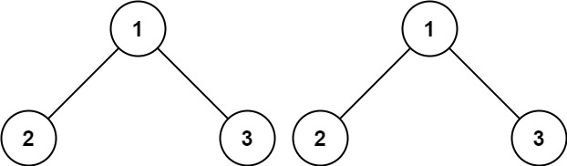
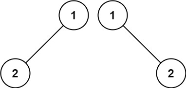
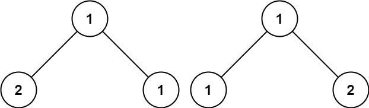

## 100. Same Tree

Given the roots of two binary trees p and q, write a function to check if they are the same or not.\
Two binary trees are considered the same if they are structurally identical, and the nodes have the same value.

Example 1:\

Input: p = [1,2,3], q = [1,2,3]\
Output: true

Example 2:\

Input: p = [1,2], q = [1,null,2]\
Output: false

Example 3:\

Input: p = [1,2,1], q = [1,1,2]\
Output: false

### gpt建議:
1. 檢查邊界值
2. 檢查所屬值
3. 遞迴比較左右子樹

```python
# Definition for a binary tree node.
# class TreeNode:
#     def __init__(self, val=0, left=None, right=None):
#         self.val = val
#         self.left = left
#         self.right = right
class Solution:
    def isSameTree(self, p: Optional[TreeNode], q: Optional[TreeNode]) -> bool:
        # ref gpt
        # 如果兩個節點都為空，返回 True
        if (not p) and (not q):
            return True
        # 如果其中一個節點為空，另一個不是，返回 False
        if (not p) or (not q):
            return False
         # 如果兩個節點的值不相等，返回 False
        if p.val != q.val:
            return False
        return self.isSameTree(p.left, q.left) and self.isSameTree(p.right, q.right)
```                