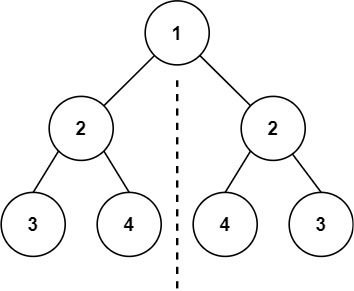

## 101. Symmetric Tree

Given the root of a binary tree, check whether it is a mirror of itself (i.e., symmetric around its center).

Example 1:\

Input: root = [1,2,2,3,4,4,3]\
Output: true

Example 2:
Input: root = [1,2,2,null,3,null,3]\
Output: false

### gpt建議:
1. 遞迴

```python
# Definition for a binary tree node.
# class TreeNode:
#     def __init__(self, val=0, left=None, right=None):
#         self.val = val
#         self.left = left
#         self.right = right
class Solution:
    def isSymmetric(self, root: Optional[TreeNode]) -> bool:
        if not root:
                return False
        def isMirror(left:TreeNode,right:TreeNode) ->bool:
            # 檢查最底層
            if not left and not right:
                return True 
            if not left or not right:
                return False
            return left.val == right.val and isMirror(left.left, right.right) and isMirror(right.left,left.right)
            
        return isMirror(root.left, root.right)
```