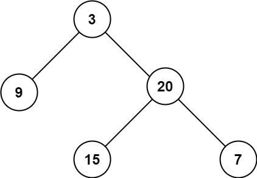

## 104. Maximum Depth of Binary Tree

Given the root of a binary tree, return its maximum depth.

A binary tree's maximum depth is the number of nodes along the longest path from the root node down to the farthest leaf node.

Example 1:\

Input: root = [3,9,20,null,null,15,7]\
Output: 3

Example 2:\
Input: root = [1,null,2]\
Output: 2

### Note:
1. 使用遞迴
2. 先考慮最後面

```python
# Definition for a binary tree node.
# class TreeNode:
#     def __init__(self, val=0, left=None, right=None):
#         self.val = val
#         self.left = left
#         self.right = right
class Solution:
    def maxDepth(self, root: Optional[TreeNode]) -> int:
        if not root:
            return 0
        leftDepth = self.maxDepth(root.left)
        rightDepth = self.maxDepth(root.right)
        return max(leftDepth,rightDepth)+ 1
```