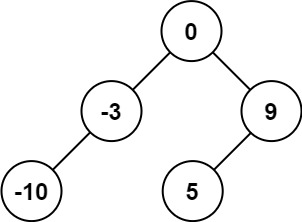
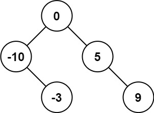
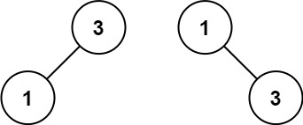

Given an integer array nums where the elements are sorted in ascending order, convert it to a height-balanced binary search tree.

Example 1:\


Input: nums = [-10,-3,0,5,9]\
Output: [0,-3,9,-10,null,5]\
Explanation: [0,-10,5,null,-3,null,9] is also accepted:

Example 2:\

Input: nums = [1,3]\
Output: [3,1]\
Explanation: [1,null,3] and [3,1] are both height-balanced BSTs.

### Note:
- 利用二分法讓 Tree 達到 height-balanced

```python
# Definition for a binary tree node.
# class TreeNode:
#     def __init__(self, val=0, left=None, right=None):
#         self.val = val
#         self.left = left
#         self.right = right
class Solution:
    def sortedArrayToBST(self, nums: List[int]) -> Optional[TreeNode]:

        if not nums:
            return None
        
        left = 0
        right = len(nums)
        mid = (left+right)//2
        root = TreeNode(nums[mid])
        root.left = self.sortedArrayToBST(nums[left:mid])
        root.right = self.sortedArrayToBST(nums[mid+1:right])
        return root
```