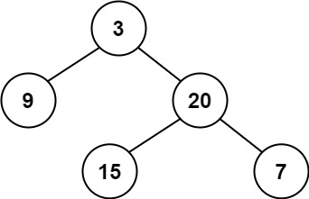
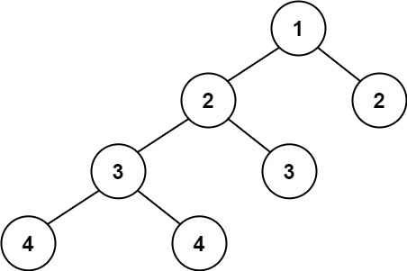

## 110. Balanced Binary Tree
Given a binary tree, determine if it is height-balanced

Example 1:\

Input: root = [3,9,20,null,null,15,7]\
Output: true

Example 2:\

Input: root = [1,2,2,3,3,null,null,4,4]\
Output: false

Example 3:
Input: root = []
Output: true

### Note:
1. 從最後一個考慮

### gpt建議:
max(leftHeight,rightHeight)+1


```python
# Definition for a binary tree node.
# class TreeNode:
#     def __init__(self, val=0, left=None, right=None):
#         self.val = val
#         self.left = left
#         self.right = right
class Solution:
    def isBalanced(self, root: Optional[TreeNode]) -> bool:
        _, balanced = self.deep(root)
        return balanced
    def deep(self,root):
        if not root:
            return 0, True
        leftHeight, leftBalance = self.deep(root.left)
        rightHeight, rightBalance = self.deep(root.right)

        currentBalance = leftBalance and rightBalance and (abs(leftHeight - rightHeight) <=1)

        return max(leftHeight,rightHeight)+1, currentBalance
```