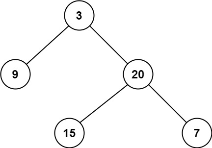

## 111. Minimum Depth of Binary Tree

Given a binary tree, find its minimum depth.\
The minimum depth is the number of nodes along the shortest path from the root node down to the nearest leaf node.\
Note: A leaf is a node with no children.

Example 1:\

Input: root = [3,9,20,null,null,15,7]\
Output: 2

Example 2:\
Input: root = [2,null,3,null,4,null,5,null,6]\
Output: 5

### gpt建議:
1. 先靠慮一般情況抵達最下層（左右同時為），回傳1
2. 若節點是空時，回傳0
3. 特殊情況只有左或右子樹

```python
# Definition for a binary tree node.
# class TreeNode:
#     def __init__(self, val=0, left=None, right=None):
#         self.val = val
#         self.left = left
#         self.right = right
class Solution:
    def minDepth(self, root: Optional[TreeNode]) -> int:
        # ref gpt
        if not root:
            return 0
        if not root.left and not root.right:
            return 1
        left = self.minDepth(root.left)
        right = self.minDepth(root.right)
        if left == 0:
            return right+1
        if right == 0:
            return left+1
        return min(left,right)+1
```
