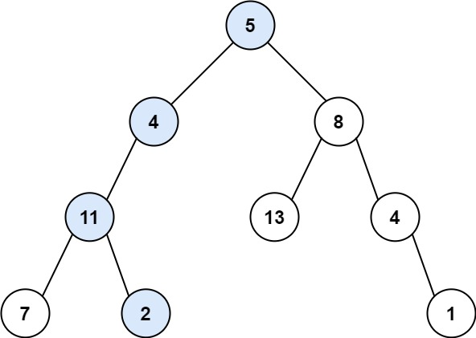
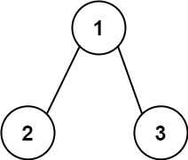

## 112. Path Sum

Given the root of a binary tree and an integer targetSum, return true if the tree has a root-to-leaf path such that adding up all the values along the path equals targetSum.

A leaf is a node with no children.

Example 1:\

Input: root = [5,4,8,11,null,13,4,7,2,null,null,null,1], targetSum = 22\
Output: true\
Explanation: The root-to-leaf path with the target sum is shown.

Example 2:\

Input: root = [1,2,3], targetSum = 5\
Output: false\
Explanation: There two root-to-leaf paths in the tree:\
(1 --> 2): The sum is 3.\
(1 --> 3): The sum is 4.\
There is no root-to-leaf path with sum = 5.

Example 3:\
Input: root = [], targetSum = 0\
Output: false\
Explanation: Since the tree is empty, there are no root-to-leaf paths.

### gpt建議:
1. 前往下一節點時更新目標值
2. 每個節點都要前往左右子節點
3. 抵達最後節點實在檢查當前節點值與目標值
#### 特殊情況:
節點是空的，直接回傳 `Ｆalse`

```python
# Definition for a binary tree node.
# class TreeNode:
#     def __init__(self, val=0, left=None, right=None):
#         self.val = val
#         self.left = left
#         self.right = right
class Solution:
    def hasPathSum(self, root: Optional[TreeNode], targetSum: int) -> bool:
        # ref gpt
        # 檢查節點是否為空
        if not root:
            return 0
        # 檢查最後節點 
        if not root.left and not root.right:
            return targetSum == root.val
        # 前往新節點時更新目標值
        targetSum -= root.val
        left = self.hasPathSum(root.left, targetSum)
        right = self.hasPathSum(root.right, targetSum)
        return left or right
```