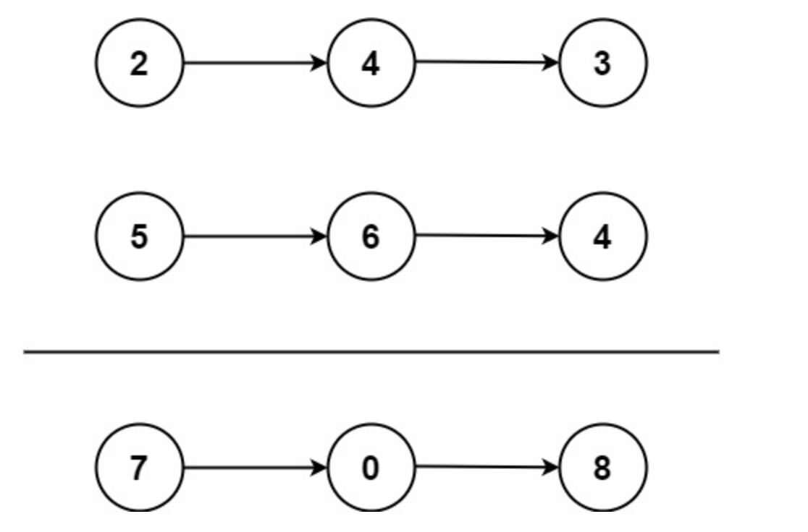
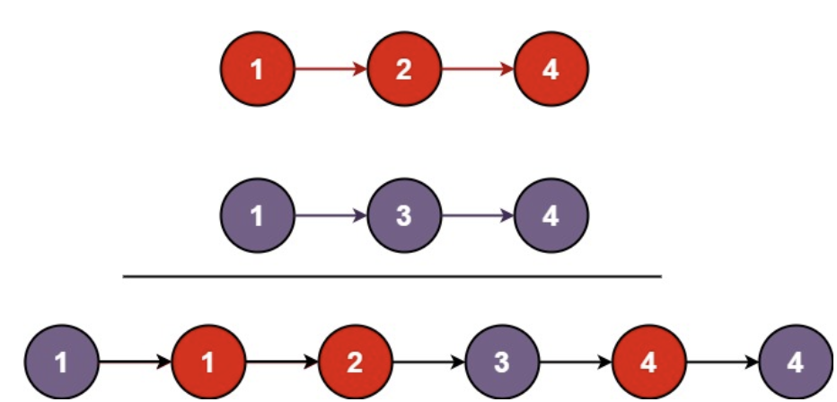
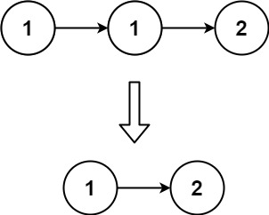
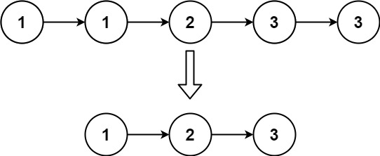

# LeetCode Python
## 1. Two Sum
題目提供：
```python
class Solution(object):
    def TwoSum(self, nums:List[int], target:int) -> List[int]:
```
題目給了一個 `class`，而`class`類中的函數必須包含`self`參數。通過 `self`，你可以在方法內部訪問實例變量和其他方法。它允許你在類的不同方法之間共享數據和狀態。

`nums: List[int]`: 輸入參數，nums 是一個整數列表。List[int] 是 Python 的類型註釋，表示 nums 是一個包含整數的列表。
`target: int`: 另一個輸入參數，target 是一個整數，表示我們要查找的兩個數字的和。

`-> List[int]`: 函數的返回類型註釋。`->` 表示函數的返回類型。`List[int]` 表示這個函數會返回一個由整數組成的列表。這有助於了解函數的輸出是什麼類型，並且能夠進行靜態類型檢查。
### 解答
```python
    def TwoSum(self, nums:List[int], target:int) -> List[int]:
        # 創建字典
        num_map = {}
        # 檢查nums list裡的元素有沒有相加等於target的
        for i, num in enurmerate(nums):
            complement = target - num # 計算當前補數
            if complement in num_map:# 檢查補數市府在num_map字典裡
            # 如果補數存在字典裡，回傳補數對應的索引和當前數字索引
                return [num_map[complement], i]
            # 如果不存在，儲存當前數字和索引於字典裡
            num_map[num] = i
        # 如果都沒有，回傳空的list
        return []
```

` for i, num in enurmerate(nums): `這段語法中，每次迭代時，enumerate(nums) 返回的一對（索引和值）會被自動解包成兩個變量：i 和 num。
ex:`[(0, nums[0]), (1, nums[1]).....]`

## 9. Palindrome Number
Given an integer `x`, return true if `x` is a palindrome, and false otherwise.

Example 1:\
Input: x = 121\
Output: true

Example 2:\
Input: x = -121\
Output: false


### 方法一：反轉全部數字
```python
def isPalindrome(self, x:int) -> bool:
    # 檢查數字是否小於0或結尾是0的數
    if x <= 0 or  (x % 10 == 0 and x !=0):
        return False
    # 反轉數字
    reverseX = 0
    temp = x
    while temp != 0:
        digit = temp % 10
        reverseX = reversX * 10 + digit
        temp //= 10  
    
    return reverseX == x
```

### 方法二：反轉一半數字
```python
def isPalindrome(self, x:int) -> bool:
    # 檢查數字是否小於0或結尾是0的數
    if x <= 0 or  (x % 10 == 0 and x !=0):
        return False
    # 反轉數字
    reverseHalf = 0
    temp = x
    while temp > reverseHalf:
        digit = temp % 10
        reverseHalf = reverseHalf * 10 + digit
        temp //= 10  
    # 當數字長度為奇數時，reverseHalf // 10 去掉中間數字
    return reverseHalf == temp or reverseHalf == temp // 10
```

## 13. Roman to Integer
|Symbol|   Value|
|------|--------|
|I     |       1|
|V     |       5|
|X     |      10|
|L     |      50|
|C     |     100|
|D     |     500|
|M     |    1000|

Example 1:\
Input: s = "III" =>1+1+1\
Output: 3

Example 2:\
Input: s = "LVIII"=>3+5+10\
Output: 58\
題目要求將提供的羅馬數字(`string`)成阿拉伯數字(`int`)，在羅馬字中出小數出線在前面時代表要用減的 ex:IV = 5-1 =4

### 解題想法
1. 要先做出一個羅馬數字`dict`
2. 字串是字元序列組成的，利用索引直來比大小
3. 注意！字串後一個字元是沒有東西好比的

### 解答
```python
class Solution:
    def romanToInt(self, s: str) -> int:
        # 創建羅馬數字dict
        romanNum = {
            "I": 1,
            "V": 5,
            "X": 10,
            "L": 50,
            "C": 100,
            "D": 500,
            "M": 1000
        }
        intNum = 0
        # 檢查羅馬數字大小
        for i in range(len(s)):
            # 如果前面數字小於後面數字
            if romanNum[s[i]] < romanNum[s[i+1]] and i < len(s):
                intNum = intNum - romanNum[s[i]]

            # 一般情況
            else:
                intNum = intNum + romanNum[s[i]]

            return intNum
```

## 2. Add Two Numbers(Med.)
給您兩個表示兩個非負整數的非空鍊錶。這些數字以相反的順序存儲，並且每個節點都包含一個數字。將兩個數字相加並以鍊錶形式傳回總和。

Example 1\


Input: l1 = [2,4,3], l2 = [5,6,4]\
Output: [7,0,8]\
Explanation: 342 + 465 = 807.

Example 2:\
Input: l1 = [0], l2 = [0]\
Output: [0]

Example 3:\
Input: l1 = [9,9,9,9,9,9,9], l2 = [9,9,9,9]\
Output: [8,9,9,9,0,0,0,1]

### 解答
```python
# Definition for singly-linked list.
# class ListNode:
#     def __init__(self, val=0, next=None):
#         self.val = val
#         self.next = next
class Solution:
    def addTwoNumbers(self, l1: Optional[ListNode], l2: Optional[ListNode]) -> Optional[ListNode]:
        # Optional 是 typing 模塊中的一个泛型類型，表示某個變量要麽是指定的類型（這裡是 ListNode），要麽是 None。
        # 創建一個虛擬的節點頭
        dummyHead = ListNode(0)
        # 創建指針只先目前位置
        current = dummyHead
        # 初始化進位
        carry = 0
        # 計算l1,l2的值
        while l1 is not None or l2 is not None:
            x = l1.val if is not None else 0
            y = l2.val if is not None else 0
            sum = x + y + carry
            # 進位計算
            carry = carry // 10
            # 將計算出的答案增加至下一個節點
            current.next = ListNode(sum % 10)
            current = current.next
            # 前往l1,l2下一節點
            if l1 is not None:
                l1 = l1.next 
            if l2 is not None:
                l2 = l2.next

            if carry > 0:
                current.next = ListCode(carry)
                
            return dummyHead.next

```

## 14. Longest Common Prefix
Write a function to find the longest common prefix string amongst an array of strings.If there is no common prefix, return an empty string "".

Example 1:\
Input: strs = ["flower","flow","flight"]\
Output: "fl"

Example 2:\
Input: strs = ["dog","racecar","car"]\
Output: ""\
Explanation: There is no common prefix among the input strings.

### 解題想法
1. 取第一個值作為比較對象
2. 注意字串長度
3. 先整理在比較

### 解答
```python
class Solution:
    def longestCommonPrefix(self, strs: List[str]) -> str:
        if strs is None:
            return ""
        strs = sorted(strs)
        prefix = ""
        first = strs[0]
        last = strs[-1]
        for i in range(min(len(first),len(last))):
            if first[i] != last[i]:
                return prefix 
            prefix += first[i]
        return prefix
```
`sorted()` 會先按照字母順序，如果字母相同長度較短的會在前面

### 20.Valid Parentheses

Given a string s containing just the characters '(', ')', '{', '}', '[' and ']', determine if the input string is valid.\
An input string is valid if:

Open brackets must be closed by the same type of brackets.\
Open brackets must be closed in the correct order.\
Every close bracket has a corresponding open bracket of the same type.
 
Example 1:\
Input: s = "()"\
Output: true

Example 2:\
Input: s = "()[]{}"\
Output: true

Example 3:\
Input: s = "(]"\
Output: false

Example 4:\
Input: s = "([])"\
Output: true

### 解題想法
1. 括號都是成對的，利用`dict` key:value
2. 利用stack先進後出，將左括號存入

### 解答
```python
class Solution:
    def isValid(self, s: str) -> bool:
        stack = []
        par = {")":"(", "}":"{", "]":"["}

        for char in s:
            if char not in par:
                stack.append(char)
            else:
                top = stack.pop() if stack else False
                if top != par[char]:
                    return False
                
        return not stack 
```
`if char not in par:` 用來檢查key，若想檢查value請用`par.value()`
 
## 3. Longest Substring Without Repeating Characters(med)

Given a string s, find the length of the longest substring without repeating characters.

Example 1:\
Input: s = "abcabcbb"\
Output: 3
Explanation: The answer is "abc", with the length of 3.

Example 2:\
Input: s = "bbbbb"\
Output: 1\
Explanation: The answer is "b", with the length of 1.

Example 3:\
Input: s = "pwwkew"\
Output: 3\
Explanation: The answer is "wke", with the length of 3. Notice that the answer must be a substring, "pwke" is a subsequence and not a substring.

### 解題想法
題目的是要找出字串中最長且不重複的子字串。
認識slide window
```python
class Solution:
    def lengthOfLongestSubstring(self, s: str) -> int:
        # 創建空集合用來裝子字串
        sub = set()
        # 左邊窗戶
        left = 0
        maxLen = 0
        # 開始檢查
        for right in range(len(s)):
            if s[right] not in sub:
                sub.add(s[right])
                # 計算子字串長度
                maxLen = max(maxLen, right - left + 1)
            # 如果遇到重複刪除前面所有字元
            while s[right] in sub:
                sub.remove(left)
                left += 1
            sub.add(s[right])
        return maxLen
```
其實可以寫得更漂亮:酷
```python
for right in range(len(s)):            
            sub.add(s[right])
            maxLen = max(maxLen, right - left + 1)
            # 如果遇到重複刪除前面所有字元
            while s[right] in sub:
                sub.remove(left)
                left += 1            
```

## 21. Merge Two Sorted Lists

You are given the heads of two sorted linked lists list1 and list2.\
Merge the two lists into one sorted list. The list should be made by splicing together the nodes of the first two lists.\
Return the head of the merged linked list.

Example 1:

Input: list1 = [1,2,4], list2 = [1,3,4]\
Output: [1,1,2,3,4,4]

Example 2:\
Input: list1 = [], list2 = []\
Output: []

Example 3:\
Input: list1 = [], list2 = [0]\
Output: [0]

### 解答
```python
# Definition for singly-linked list.
# class ListNode:
#     def __init__(self, val=0, next=None):
#         self.val = val
#         self.next = next
class Solution:
    def mergeTwoLists(self, list1: Optional[ListNode], list2: Optional[ListNode]) -> Optional[ListNode]:
        # 創建一個ListNode用來儲存整理好的資料
        dummy = ListNode(0)
        current = dummy # 將指針指向虛頭
 
        while list1 and list2:
            if list1.val < list2.val:
                current.next = list1
                list1 = list1.next 
            else:
                current.next = list2
                list2 = list2.next 
            current = current.next
        if list1:
            current.next = list1
        elif list2:
            current.next = list2

        return dummy.next
```

## 26. Remove Duplicates from Sorted Array

Example 1:\
Input: nums = [1,1,2]\
Output: 2, nums = [1,2,_]\
Explanation: Your function should return k = 2, with the first two elements of nums being 1 and 2 respectively.\
It does not matter what you leave beyond the returned k (hence they are underscores).

Example 2:\
Input: nums = [0,0,1,1,1,2,2,3,3,4]\
Output: 5, nums = [0,1,2,3,4,_,_,_,_,_]\
Explanation: Your function should return k = 5, with the first five elements of nums being 0, 1, 2, 3, and 4 respectively.\
It does not matter what you leave beyond the returned k (hence they are underscores).

### 解題想法
與 Longest Substring Without Repeating Character

### 解答
```python
class Solution:
    def removeDuplicates(self, nums: List[int]) -> int:
        slow = 0
        for fast in range (1,len(nums)):
            if nums[slow]!= nums[fast]:
                slow += 1
                nums[slow] = nums[fast] 
            
        return slow + 1
```

## 7. Reverse Integer

Given a signed 32-bit integer x, return x with its digits reversed. If reversing x causes the value to go outside the signed 32-bit integer range [-231, 231 - 1], then return 0.

Example 1:\
Input: x = 123\
Output: 321

Example 2:\
Input: x = -123\
Output: -321

Example 3:\
Input: x = 120\
Output: 21

```python
class Solution:
    def reverse(self, x: int) -> int:
        n =  abs(x) if x < 0 else x
        rev = 0
        while n:
            rev = rev * 10 + n % 10
            n = n // 10
            if 2**31-1 < rev: 
                return 0

        rev = rev if x > 0 else -rev
        return rev
```

## 15. 3Sum
Given an integer array nums, return all the triplets [nums[i], nums[j], nums[k]] such that i != j, i != k, and j != k, and nums[i] + nums[j] + nums[k] == 0.

Notice that the solution set must not contain duplicate triplets.

Example 1:\
Input: nums = [-1,0,1,2,-1,-4]\
Output: [[-1,-1,2],[-1,0,1]]\
Explanation: \
nums[0] + nums[1] + nums[2] = (-1) + 0 + 1 = 0.\
nums[1] + nums[2] + nums[4] = 0 + 1 + (-1) = 0.\
nums[0] + nums[3] + nums[4] = (-1) + 2 + (-1) = 0.\
The distinct triplets are [-1,0,1] and [-1,-1,2].\
Notice that the order of the output and the order of the triplets does not matter.

Example 2:\
Input: nums = [0,1,1]\
Output: []\
Explanation: The only possible triplet does not sum up to 0.

Example 3:\
Input: nums = [0,0,0]\
Output: [[0,0,0]]\
Explanation: The only possible triplet sums up to 0.

### 解題方法(med.)
捕魚法，不要用2sum找補數會漏找

## 解答
```python
class Solution:
    def threeSum(self, nums: List[int]) -> List[List[int]]:
        tri = []
        nums = sorted(nums)

        for i in range(len(nums)-2):
            # 檢查跟前一個有沒有相同
            # 不要跟下一個比不然會有漏網之魚
            if i > 0 and nums[i] == nums[i-1]:
                # print(i,"\n")
                continue
            left = i+1
            right = len(nums)-1
            while left < right:
                total = nums[i] + nums[left] + nums[right]
                if total < 0:
                    left+=1
                elif total > 0:
                    right-=1
                else:
                    tri.append([nums[i], nums[left], nums[right]])
                    # 檢查框框內有沒有重複的，有的話要一直往內縮
                    while left < right and nums[left]==nums[left+1]:
                        left+=1
                    while left < right and nums[right]==nums[right-1]:
                        right-=1
                    left+=1
                    right-=1
        return tri
```

## 35. Search Insert Position

Given a sorted array of distinct integers and a target value, return the index if the target is found. If not, return the index where it would be if it were inserted in order.

You must write an algorithm with O(log n) runtime complexity.

Example 1:\
Input: nums = [1,3,5,6], target = 5\
Output: 2

Example 2:\
Input: nums = [1,3,5,6], target = 2\
Output: 1

Example 3:\
Input: nums = [1,3,5,6], target = 7\
Output: 4
### 解題想法
使用二分法

### 解答
```python
class Solution:
    def searchInsert(self, nums: List[int], target: int) -> int:
        left = 0
        right = len(nums)-1
        # 設定邊界一定要設在有效索引內
        while left <= right: #設定條件要注意
            mid = left+(right-left)//2
            if target < nums[mid]:
                right = mid-1
            elif target > nums[mid]:
                left = mid + 1
            else:
                return mid
        return left
```
## 53. Maximum Subarray
Given an integer array nums, find the subarray with the largest sum, and return its sum.

Example 1:
Input: nums = [-2,1,-3,4,-1,2,1,-5,4]\
Output: 6\
Explanation: The subarray [4,-1,2,1] has the largest sum 6.

Example 2:\
Input: nums = [1]\
Output: 1\
Explanation: The subarray [1] has the largest sum 1.

Example 3:\
Input: nums = [5,4,-1,7,8]\
Output: 23\
Explanation: The subarray [5,4,-1,7,8] has the largest sum 23.

### 解答
```python
class Solution:
    def maxSubArray(self, nums: List[int]) -> int:
        currentSum = nums[0]
        maxSum = nums[0]

        for num in nums[1:]:
            currentSum = max(num, currentSum+num)
            maxSum = max(maxSum,currentSum)
        return maxSum = nums[0]
```

### 83. Remove Duplicates from Sorted List
Given the head of a sorted linked list, delete all duplicates such that each element appears only once. Return the linked list sorted as well.

Example 1:\

Input: head = [1,1,2]\
Output: [1,2]

Example 2:\

Input: head = [1,1,2,3,3]\
Output: [1,2,3]

### 解題方法
利用指針current，當相鄰兩束相同時要跳過，不同時指針向下過移動。

### 解答
```python
# Definition for singly-linked list.
# class ListNode:
#     def __init__(self, val=0, next=None):
#         self.val = val
#         self.next = next
class Solution:
    def deleteDuplicates(self, head: Optional[ListNode]) -> Optional[ListNode]:

        current = head
        if current is None:
            return head
            
        while current.next:
            if current.next.val  == current.val:
                current.next = current.next.next

            elif current.next.val != current.val:
                current = current.next
        
            
        return head
```

## 67. Add Binary
Given two binary strings a and b, return their sum as a binary string.

Example 1:\
Input: a = "11", b = "1"\
Output: "100"

Example 2:\
Input: a = "1010", b = "1011"\
Output: "10101"

### 解方法
注意方向索引值最大的是個位數

## 解答
```python
class Solution:
    def addBinary(self, a: str, b: str) -> str:
        result = []
        carry = 0
        i, j = len(a) - 1, len(b) - 1  
        
        while i >= 0 or j >= 0 or carry:
            bit_a = int(a[i]) if i >= 0 else 0
            bit_b = int(b[j]) if j >= 0 else 0
            total = bit_a + bit_b + carry
            carry = (total)//2
            result.append(str(total%2))
            i-=1
            j-=1

        return "".join(reversed(result))
```
## 19. Remove Nth Node From End of List


```python
# Definition for singly-linked list.
# class ListNode:
#     def __init__(self, val=0, next=None):
#         self.val = val
#         self.next = next
class Solution:
    def removeNthFromEnd(self, head: Optional[ListNode], n: int) -> Optional[ListNode]:
        # 創建虛擬頭節點（如果要刪除的是第一個節點）
        dummy = ListNode(0)
        dummy.next = head
        # 初始化指針 slow、fast 。
        slow = dummy
        fast = dummy
        # slow 與 fast 相距 n 步，slow為被刪除的前一個(寫進 while 迴圈裡)
        for i in range(n+1):
                fast = fast.next        
        while fast:
            fast = fast.next
            slow = slow.next
        slow.next = slow.next.next

        return dummy.next
```