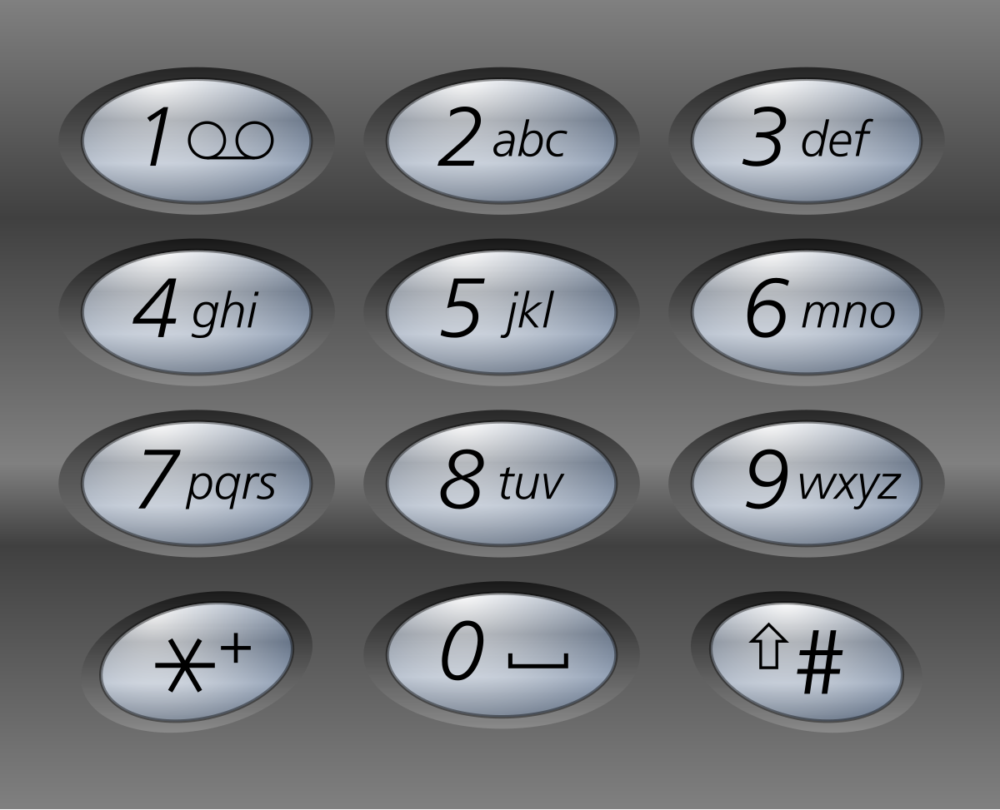

# LeetCode Python
## 1. Two Sum
題目提供：
```python
class Solution(object):
    def TwoSum(self, nums:List[int], target:int) -> List[int]:
```
題目給了一個 `class`，而`class`類中的函數必須包含`self`參數。通過 `self`，你可以在方法內部訪問實例變量和其他方法。它允許你在類的不同方法之間共享數據和狀態。

`nums: List[int]`: 輸入參數，nums 是一個整數列表。List[int] 是 Python 的類型註釋，表示 nums 是一個包含整數的列表。
`target: int`: 另一個輸入參數，target 是一個整數，表示我們要查找的兩個數字的和。

`-> List[int]`: 函數的返回類型註釋。`->` 表示函數的返回類型。`List[int]` 表示這個函數會返回一個由整數組成的列表。這有助於了解函數的輸出是什麼類型，並且能夠進行靜態類型檢查。
### 解答
```python
    def TwoSum(self, nums:List[int], target:int) -> List[int]:
        # 創建字典
        num_map = {}
        # 檢查nums list裡的元素有沒有相加等於target的
        for i, num in enumerate(nums):
            complement = target - num # 計算當前補數
            if complement in num_map:# 檢查補數是否在num_map字典裡
            # 如果補數存在字典裡，回傳補數對應的索引和當前數字索引
                return [num_map[complement], i]
            # 如果不存在，儲存當前數字和索引於字典裡
            num_map[num] = i
        # 如果都沒有，回傳空的list
        return []
```

` for i, num in enurmerate(nums): `這段語法中，每次迭代時，enumerate(nums) 返回的一對（索引和值）會被自動解包成兩個變量：i 和 num。
ex:`[(0, nums[0]), (1, nums[1]).....]`

## 9. Palindrome Number
Given an integer `x`, return true if `x` is a palindrome, and false otherwise.

Example 1:\
Input: x = 121\
Output: true

Example 2:\
Input: x = -121\
Output: false


### 方法一：反轉全部數字
```python
def isPalindrome(self, x:int) -> bool:
    # 檢查數字是否小於0或結尾是0的數
    if x <= 0 or  (x % 10 == 0 and x !=0):
        return False
    # 反轉數字
    reverseX = 0
    temp = x
    while temp != 0:
        digit = temp % 10
        reverseX = reversX * 10 + digit
        temp //= 10  
    
    return reverseX == x
```

## 13. Roman to Integer
Roman numerals are represented by seven different symbols: I, V, X, L, C, D and M.

|Symbol|   Value|
|------|--------|
|I     |       1|
|V     |       5|
|X     |      10|
|L     |      50|
|C     |     100|
|D     |     500|
|M     |    1000|

For example, 2 is written as II in Roman numeral, just two ones added together. 12 is written as XII, which is simply X + II. The number 27 is written as XXVII, which is XX + V + II.

- I can be placed before V (5) and X (10) to make 4 and 9. 
- X can be placed before L (50) and C (100) to make 40 and 90. 
- C can be placed before D (500) and M (1000) to make 400 and 900.

Example 1:\
Input: s = "III" =>1+1+1\
Output: 3

Example 2:\
Input: s = "LVIII"=>3+5+10\
Output: 58\

題目要求將提供的羅馬數字(`string`)成阿拉伯數字(`int`)，在羅馬字中出小數出線在前面時代表要用減的 ex:IV = 5-1 =4

### 解題想法
1. 要先做出一個羅馬數字`dict`
2. 字串是字元序列組成的，利用索引直來比大小
3. 注意！字串後一個字元是沒有東西好比的

### 解答
```python
class Solution:
    def romanToInt(self, s: str) -> int:
        # 創建羅馬數字dict
        romanNum = {
            "I": 1,
            "V": 5,
            "X": 10,
            "L": 50,
            "C": 100,
            "D": 500,
            "M": 1000
        }
        intNum = 0
        # 檢查羅馬數字大小
        for i in range(len(s)):
            # 如果前面數字小於後面數字
            if romanNum[s[i]] < romanNum[s[i+1]] and i < len(s):
                intNum = intNum - romanNum[s[i]]

            # 一般情況
            else:
                intNum = intNum + romanNum[s[i]]

            return intNum
```

## 2. Add Two Numbers(Med.)
給您兩個表示兩個非負整數的非空鍊錶。這些數字以相反的順序存儲，並且每個節點都包含一個數字。將兩個數字相加並以鍊錶形式傳回總和。

Example 1\


Input: l1 = [2,4,3], l2 = [5,6,4]\
Output: [7,0,8]\
Explanation: 342 + 465 = 807.

Example 2:\
Input: l1 = [0], l2 = [0]\
Output: [0]

Example 3:\
Input: l1 = [9,9,9,9,9,9,9], l2 = [9,9,9,9]\
Output: [8,9,9,9,0,0,0,1]

### 解答
```python
# Definition for singly-linked list.
# class ListNode:
#     def __init__(self, val=0, next=None):
#         self.val = val
#         self.next = next
class Solution:
    def addTwoNumbers(self, l1: Optional[ListNode], l2: Optional[ListNode]) -> Optional[ListNode]:
        # Optional 是 typing 模塊中的一个泛型類型，表示某個變量要麽是指定的類型（這裡是 ListNode），要麽是 None。
        # 創建一個虛擬的節點頭
        dummyHead = ListNode(0)
        # 創建指針只先目前位置
        current = dummyHead
        # 初始化進位
        carry = 0
        # 計算l1,l2的值
        while l1 is not None or l2 is not None:
            x = l1.val if is not None else 0
            y = l2.val if is not None else 0
            sum = x + y + carry
            # 進位計算
            carry = carry // 10
            # 將計算出的答案增加至下一個節點
            current.next = ListNode(sum % 10)
            current = current.next
            # 前往l1,l2下一節點
            if l1 is not None:
                l1 = l1.next 
            if l2 is not None:
                l2 = l2.next

            if carry > 0:
                current.next = ListCode(carry)
                
            return dummyHead.next
```

## 14. Longest Common Prefix
Write a function to find the longest common prefix string amongst an array of strings.If there is no common prefix, return an empty string "".

Example 1:\
Input: strs = ["flower","flow","flight"]\
Output: "fl"

Example 2:\
Input: strs = ["dog","racecar","car"]\
Output: ""\
Explanation: There is no common prefix among the input strings.

### 解題想法
1. 取第一個值作為比較對象
2. 注意字串長度
3. 先整理在比較

### 解答
```python
class Solution:
    def longestCommonPrefix(self, strs: List[str]) -> str:
        if strs is None:
            return ""
        strs = sorted(strs)
        prefix = ""
        first = strs[0]
        last = strs[-1]
        for i in range(min(len(first),len(last))):
            if first[i] != last[i]:
                return prefix 
            prefix += first[i]
        return prefix
```
`sorted()` 會先按照字母順序，如果字母相同長度較短的會在前面

### 20.Valid Parentheses

Given a string s containing just the characters '(', ')', '{', '}', '[' and ']', determine if the input string is valid.\
An input string is valid if:

Open brackets must be closed by the same type of brackets.\
Open brackets must be closed in the correct order.\
Every close bracket has a corresponding open bracket of the same type.
 
Example 1:\
Input: s = "()"\
Output: true

Example 2:\
Input: s = "()[]{}"\
Output: true

Example 3:\
Input: s = "(]"\
Output: false

Example 4:\
Input: s = "([])"\
Output: true

### 解題想法
1. 括號都是成對的，利用`dict` key:value
2. 利用stack先進後出，將左括號存入

### 解答
```python
class Solution:
    def isValid(self, s: str) -> bool:
        stack = []
        par = {")":"(", "}":"{", "]":"["}

        for char in s:
            if char not in par:
                stack.append(char)
            else:
                top = stack.pop() if stack else False
                if top != par[char]:
                    return False
                
        return not stack 
```
`if char not in par:` 用來檢查key，若想檢查value請用`par.value()`
 
## 3. Longest Substring Without Repeating Characters(med)

Given a string s, find the length of the longest substring without repeating characters.

Example 1:\
Input: s = "abcabcbb"\
Output: 3
Explanation: The answer is "abc", with the length of 3.

Example 2:\
Input: s = "bbbbb"\
Output: 1\
Explanation: The answer is "b", with the length of 1.

Example 3:\
Input: s = "pwwkew"\
Output: 3\
Explanation: The answer is "wke", with the length of 3. Notice that the answer must be a substring, "pwke" is a subsequence and not a substring.

### 解題想法
題目的是要找出字串中最長且不重複的子字串。
認識slide window
```python
class Solution:
    def lengthOfLongestSubstring(self, s: str) -> int:
        # 創建空集合用來裝子字串
        sub = set()
        # 左邊窗戶
        left = 0
        maxLen = 0
        # 開始檢查
        for right in range(len(s)):
            if s[right] not in sub:
                sub.add(s[right])
                # 計算子字串長度
                maxLen = max(maxLen, right - left + 1)
            # 如果遇到重複刪除前面所有字元
            while s[right] in sub:
                sub.remove(left)
                left += 1
            sub.add(s[right])
        return maxLen
```
其實可以寫得更漂亮:酷
```python
for right in range(len(s)):            
            sub.add(s[right])
            maxLen = max(maxLen, right - left + 1)
            # 如果遇到重複刪除前面所有字元
            while s[right] in sub:
                sub.remove(left)
                left += 1            
```

## 21. Merge Two Sorted Lists

You are given the heads of two sorted linked lists list1 and list2.\
Merge the two lists into one sorted list. The list should be made by splicing together the nodes of the first two lists.\
Return the head of the merged linked list.

Example 1:

Input: list1 = [1,2,4], list2 = [1,3,4]\
Output: [1,1,2,3,4,4]

Example 2:\
Input: list1 = [], list2 = []\
Output: []

Example 3:\
Input: list1 = [], list2 = [0]\
Output: [0]

### 解答
```python
# Definition for singly-linked list.
# class ListNode:
#     def __init__(self, val=0, next=None):
#         self.val = val
#         self.next = next
class Solution:
    def mergeTwoLists(self, list1: Optional[ListNode], list2: Optional[ListNode]) -> Optional[ListNode]:
        # 創建一個ListNode用來儲存整理好的資料
        dummy = ListNode(0)
        current = dummy # 將指針指向虛頭
 
        while list1 and list2:
            if list1.val < list2.val:
                current.next = list1
                list1 = list1.next 
            else:
                current.next = list2
                list2 = list2.next 
            current = current.next
        if list1:
            current.next = list1
        elif list2:
            current.next = list2

        return dummy.next
```

## 26. Remove Duplicates from Sorted Array

Example 1:\
Input: nums = [1,1,2]\
Output: 2, nums = [1,2,_]\
Explanation: Your function should return k = 2, with the first two elements of nums being 1 and 2 respectively.\
It does not matter what you leave beyond the returned k (hence they are underscores).

Example 2:\
Input: nums = [0,0,1,1,1,2,2,3,3,4]\
Output: 5, nums = [0,1,2,3,4,_,_,_,_,_]\
Explanation: Your function should return k = 5, with the first five elements of nums being 0, 1, 2, 3, and 4 respectively.\
It does not matter what you leave beyond the returned k (hence they are underscores).

### 解題想法
與 Longest Substring Without Repeating Character

### 解答
```python
class Solution:
    def removeDuplicates(self, nums: List[int]) -> int:
        slow = 0
        for fast in range (1,len(nums)):
            if nums[slow]!= nums[fast]:
                slow += 1
                nums[slow] = nums[fast] 
            
        return slow + 1
```

## 7. Reverse Integer

Given a signed 32-bit integer x, return x with its digits reversed. If reversing x causes the value to go outside the signed 32-bit integer range [-231, 231 - 1], then return 0.

Example 1:\
Input: x = 123\
Output: 321

Example 2:\
Input: x = -123\
Output: -321

Example 3:\
Input: x = 120\
Output: 21

```python
class Solution:
    def reverse(self, x: int) -> int:
        n =  abs(x) if x < 0 else x
        rev = 0
        while n:
            rev = rev * 10 + n % 10
            n = n // 10
            if 2**31-1 < rev: 
                return 0

        rev = rev if x > 0 else -rev
        return rev
```

## 15. 3Sum
Given an integer array nums, return all the triplets [nums[i], nums[j], nums[k]] such that i != j, i != k, and j != k, and nums[i] + nums[j] + nums[k] == 0.

Notice that the solution set must not contain duplicate triplets.

Example 1:\
Input: nums = [-1,0,1,2,-1,-4]\
Output: [[-1,-1,2],[-1,0,1]]\
Explanation: \
nums[0] + nums[1] + nums[2] = (-1) + 0 + 1 = 0.\
nums[1] + nums[2] + nums[4] = 0 + 1 + (-1) = 0.\
nums[0] + nums[3] + nums[4] = (-1) + 2 + (-1) = 0.\
The distinct triplets are [-1,0,1] and [-1,-1,2].\
Notice that the order of the output and the order of the triplets does not matter.

Example 2:\
Input: nums = [0,1,1]\
Output: []\
Explanation: The only possible triplet does not sum up to 0.

Example 3:\
Input: nums = [0,0,0]\
Output: [[0,0,0]]\
Explanation: The only possible triplet sums up to 0.

### 解題方法(med.)
捕魚法，不要用2sum找補數會漏找

### 解答
```python
class Solution:
    def threeSum(self, nums: List[int]) -> List[List[int]]:
        tri = []
        nums = sorted(nums)

        for i in range(len(nums)-2):
            # 檢查跟前一個有沒有相同
            # 不要跟下一個比不然會有漏網之魚
            if i > 0 and nums[i] == nums[i-1]:
                # print(i,"\n")
                continue
            left = i+1
            right = len(nums)-1
            while left < right:
                total = nums[i] + nums[left] + nums[right]
                if total < 0:
                    left+=1
                elif total > 0:
                    right-=1
                else:
                    tri.append([nums[i], nums[left], nums[right]])
                    # 檢查框框內有沒有重複的，有的話要一直往內縮
                    while left < right and nums[left]==nums[left+1]:
                        left+=1
                    while left < right and nums[right]==nums[right-1]:
                        right-=1
                    left+=1
                    right-=1
        return tri
```

## 35. Search Insert Position

Given a sorted array of distinct integers and a target value, return the index if the target is found. If not, return the index where it would be if it were inserted in order.

You must write an algorithm with O(log n) runtime complexity.

Example 1:\
Input: nums = [1,3,5,6], target = 5\
Output: 2

Example 2:\
Input: nums = [1,3,5,6], target = 2\
Output: 1

Example 3:\
Input: nums = [1,3,5,6], target = 7\
Output: 4
### 解題想法
使用二分法

### 解答
```python
class Solution:
    def searchInsert(self, nums: List[int], target: int) -> int:
        left = 0
        right = len(nums)-1
        # 設定邊界一定要設在有效索引內
        while left <= right: #設定條件要注意
            mid = left+(right-left)//2
            if target < nums[mid]:
                right = mid-1
            elif target > nums[mid]:
                left = mid + 1
            else:
                return mid
        return left
```
## 53. Maximum Subarray
Given an integer array nums, find the subarray with the largest sum, and return its sum.

Example 1:
Input: nums = [-2,1,-3,4,-1,2,1,-5,4]\
Output: 6\
Explanation: The subarray [4,-1,2,1] has the largest sum 6.

Example 2:\
Input: nums = [1]\
Output: 1\
Explanation: The subarray [1] has the largest sum 1.

Example 3:\
Input: nums = [5,4,-1,7,8]\
Output: 23\
Explanation: The subarray [5,4,-1,7,8] has the largest sum 23.

### 解答
```python
class Solution:
    def maxSubArray(self, nums: List[int]) -> int:
        currentSum = nums[0]
        maxSum = nums[0]

        for num in nums[1:]:
            currentSum = max(num, currentSum+num)
            maxSum = max(maxSum,currentSum)
        return maxSum = nums[0]
```

## 83. Remove Duplicates from Sorted List
Given the head of a sorted linked list, delete all duplicates such that each element appears only once. Return the linked list sorted as well.

Example 1:\

Input: head = [1,1,2]\
Output: [1,2]

Example 2:\

Input: head = [1,1,2,3,3]\
Output: [1,2,3]

### 解題方法
利用指針current，當相鄰兩束相同時要跳過，不同時指針向下過移動。

### 解答
```python
# Definition for singly-linked list.
# class ListNode:
#     def __init__(self, val=0, next=None):
#         self.val = val
#         self.next = next
class Solution:
    def deleteDuplicates(self, head: Optional[ListNode]) -> Optional[ListNode]:

        current = head
        if current is None:
            return head
            
        while current.next:
            if current.next.val  == current.val:
                current.next = current.next.next

            elif current.next.val != current.val:
                current = current.next
        
            
        return head
```

## 67. Add Binary
Given two binary strings a and b, return their sum as a binary string.

Example 1:\
Input: a = "11", b = "1"\
Output: "100"

Example 2:\
Input: a = "1010", b = "1011"\
Output: "10101"

### 解方法
注意方向索引值最大的是個位數

### 解答
```python
class Solution:
    def addBinary(self, a: str, b: str) -> str:
        result = []
        carry = 0
        i, j = len(a) - 1, len(b) - 1  
        
        while i >= 0 or j >= 0 or carry:
            bit_a = int(a[i]) if i >= 0 else 0
            bit_b = int(b[j]) if j >= 0 else 0
            total = bit_a + bit_b + carry
            carry = (total)//2
            result.append(str(total%2))
            i-=1
            j-=1

        return "".join(reversed(result))
```
## 19. Remove Nth Node From End of List(med.)

Given the head of a linked list, remove the nth node from the end of the list and return its head.

Example 1:\
Input: head = [1,2,3,4,5], n = 2\
Output: [1,2,3,5]

Example 2:\
Input: head = [1], n = 1\
Output: []

Example 3:\
Input: head = [1,2], n = 1\
Output: [1]

### 解題方法
使用雙指針，注意初始化值，設為虛擬化頭解除所有煩惱

### 解答
```python
# Definition for singly-linked list.
# class ListNode:
#     def __init__(self, val=0, next=None):
#         self.val = val
#         self.next = next
class Solution:
    def removeNthFromEnd(self, head: Optional[ListNode], n: int) -> Optional[ListNode]:
        # 創建虛擬頭節點（如果要刪除的是第一個節點）
        dummy = ListNode(0)
        dummy.next = head
        # 初始化指針 slow、fast 。
        slow = dummy
        fast = dummy
        # slow 與 fast 相距 n 步，slow為被刪除的前一個(寫進 while 迴圈裡)
        for i in range(n+1):
                fast = fast.next        
        while fast:
            fast = fast.next
            slow = slow.next
        slow.next = slow.next.next

        return dummy.next
```

## 56. Merge Intervals(med.)
Given an array of intervals where intervals[i] = [starti, endi], merge all overlapping intervals, and return an array of the non-overlapping intervals that cover all the intervals in the input.

Example 1:\
Input: intervals = [[1,3],[2,6],[8,10],[15,18]]\
Output: [[1,6],[8,10],[15,18]]\
Explanation: Since intervals [1,3] and [2,6] overlap, merge them into [1,6].

Example 2:\
Input: intervals = [[1,4],[4,5]]\
Output: [[1,5]]\
Explanation: Intervals [1,4] and [4,5] are considered overlapping.

### 解答
```python
class Solution:
    def merge(self, intervals: List[List[int]]) -> List[List[int]]:
        # 創建堆疊
        stack = []
        intervals = sorted(intervals)
        # 將第一個子列亞入堆疊
        stack.append(intervals[0])
        for i in range(1,len(intervals)):
            # 當前[start,end]
            b1 = intervals[i][0]
            b2 = intervals[i][1]
            # stack中top[start,end]
            a1 = stack[-1][0]
            a2 = stack[-1][1]
            print(a1,a2,b1,b2)
            # 如果重疊
            if a2 >= b1:
                stack[-1][1] = max(a2, b2)
                # 要嘛用pop,不要用a2改!
            else:
                stack.append(intervals[i])
        return stack
```

## 136. Single Number

Given a non-empty array of integers nums, every element appears twice except for one. Find that single one.

You must implement a solution with a linear runtime complexity and use only constant extra space.

Example 1:
Input: nums = [2,2,1]\
Output: 1

Example 2:\
Input: nums = [4,1,2,1,2]\
Output: 4

Example 3:\
Input: nums = [1]\
Output: 1

```python
class Solution:
    def singleNumber(self, nums: List[int]) -> int:
        seen = {}
        # 預設值為1如果重複+1
        for i in nums:
            if i in seen:
                seen[i] +=1  
            else:
                seen[i] = 1
        for key, val in seen.items():
            if val == 1: 
                return key
```

## 101. Symmetric Tree
Given the root of a binary tree, check whether it is a mirror of itself (i.e., symmetric around its center).

Example 1:\
Input: root = [1,2,2,3,4,4,3]\
Output: true

Example 2:
Input: root = [1,2,2,null,3,null,3]\
Output: false

### 解答
```python
# Definition for a binary tree node.
# class TreeNode:
#     def __init__(self, val=0, left=None, right=None):
#         self.val = val
#         self.left = left
#         self.right = right
class Solution:
    def isSymmetric(self, root: Optional[TreeNode]) -> bool:
        if not root:
                return False
        def isMirror(left:TreeNode,right:TreeNode) ->bool:
            # 檢查最底層
            if not left and not right:
                return True 
            if not left or not right:
                return False
            return left.val == right.val and isMirror(left.left, right.right) and isMirror(right.left,left.right)
            
        return isMirror(root.left, root.right)
```
5. Longest Palindromic Substring

Given a string s, return the longest palindromic substring in s.

Example 1:\
Input: s = "babad"\
Output: "bab"\
Explanation: "aba" is also a valid answer.

Example 2:\
Input: s = "cbbd"\
Output: "bb"
 
```python
class Solution:
    def longestPalindrome(self, s: str) -> str:
        psub = s[0]
        if len(s)>=2 and s[0] ==s[1]:
            psub = s[0:2]
        
        for i in range(1,len(s)-1):
            # 如果是奇數回文
            if s[i-1] == s[i+1]:
                left = i-1
                right = i+1
                while right<len(s) and left >=0 and s[left] == s[right]:
                    if len(s[left:right+1]) > len(psub):
                        psub = s[left:right+1]
                    left-=1
                    right+=1
            # 如果是偶數回文
            if s[i] == s[i+1]:
                left = i
                right = i+1
                while right<len(s) and left >=0 and s[left] == s[right]:
                    if len(s[left:right+1]) > len(psub):
                        psub = s[left:right+1]
                    left-=1
                    right+=1
            
        return psub
```
## 104. Maximum Depth of Binary Tree

Given the root of a binary tree, return its maximum depth.

A binary tree's maximum depth is the number of nodes along the longest path from the root node down to the farthest leaf node.

Example 1:\

Input: root = [3,9,20,null,null,15,7]\
Output: 3

Example 2:\
Input: root = [1,null,2]\
Output: 2

### 解答
```python
# Definition for a binary tree node.
# class TreeNode:
#     def __init__(self, val=0, left=None, right=None):
#         self.val = val
#         self.left = left
#         self.right = right
class Solution:
    def maxDepth(self, root: Optional[TreeNode]) -> int:
        def Depth(root) ->int:
            if not root:
                return 0
            leftDepth = Depth(root.left)
            rightDepth = Depth(root.right)
            return max(leftDepth,rightDepth)+ 1
        return Depth(root)
```

## 70. Climbing Stairs
You are climbing a staircase. It takes n steps to reach the top.
Each time you can either climb 1 or 2 steps. In how many distinct ways can you climb to the top?

Example 1:
Input: n = 2
Output: 2
Explanation: There are two ways to climb to the top.
1. 1 step + 1 step
2. 2 steps

Example 2:
Input: n = 3
Output: 3
Explanation: There are three ways to climb to the top.
1. 1 step + 1 step + 1 step
2. 1 step + 2 steps
3. 2 steps + 1 step

### 解題方法
可以用迭代的但會超出時間\
`f(n) = f(n-1) + f(n-2)`
當只有一個階梯`n=1`，只有1種方法\
當`n=2`，有2種方法

```python
class Solution:
    def climbStairs(self, n: int) -> int:
        if n <= 1:
            return 1
        return self.climbStairs(n-1)+self.climbStairs(n-2)
```

### 解答
```python
class Solution:
    def climbStairs(self, n: int) -> int:
        
        if n == 1:
            return 1
        if n == 2:
            return 2
        
        stair1 = 1
        stair2 = 2
        current = 0
        for i in range(3,n+1):
            current = stair1 + stair2
            stair1 = stair2
            stair2 = current
        return current
```
## 6. Zigzag Conversion
The string "PAYPALISHIRING" is written in a zigzag pattern on a given number of rows like this: (you may want to display this pattern in a fixed font for better legibility)

P   A   H   N\
A P L S I I G\
Y   I   R\
And then read line by line: "PAHNAPLSIIGYIR"\
Write the code that will take a string and make this conversion given a number of rows:\
string convert(string s, int numRows);
 
Example 1:\
Input: s = "PAYPALISHIRING", numRows = 3\
Output: "PAHNAPLSIIGYIR"

Example 2:\
Input: s = "PAYPALISHIRING", numRows = 4\
Output: "PINALSIGYAHRPI"\
Explanation:\
P     I    N\
A   L S  I G\
Y A   H R\
P     I

Example 3:\
Input: s = "A", numRows = 1\
Output: "A"

```python
class Solution:
    def convert(self, s: str, numRows: int) -> str:
        if numRows == 1 or numRows>len(s):
            return s
        # 創建一個大小為 numRows 的列表
        z1 = [""]*numRows
        j = 1
        #當前的行號
        current_row = 0
        for i in s:
            z1[current_row]+=i
            if current_row == numRows-1:
                j = -1 
            elif current_row == 0:
                j = 1 
            current_row += j
        return ''.join(z1)
                
```
## 27. Remove Element

Example 1:\
Input: nums = [3,2,2,3], val = 3\
Output: 2, nums = [2,2,_,_]\
Explanation: Your function should return k = 2, with the first two elements of nums being 2.\
It does not matter what you leave beyond the returned k (hence they are underscores).

Example 2:\
Input: nums = [0,1,2,2,3,0,4,2], val = 2\
Output: 5, nums = [0,1,4,0,3,_,_,_]\
Explanation: Your function should return k = 5, with the first five elements of nums containing 0, 0, 1, 3, and 4.\
Note that the five elements can be returned in any order.\
It does not matter what you leave beyond the returned k (hence they are underscores).

### 解答

```python
class Solution:
    def removeElement(self, nums: List[int], val: int) -> int:
        # 雙指針
        k = 0
        for i in nums:
            if i!=val:
                nums[k] = i
                k+=1
        return k
```

## 28. Find the Index of the First Occurrence in a String

Example 1:\
Input: haystack = "sadbutsad", needle = "sad"\
Output: 0\
Explanation: "sad" occurs at index 0 and 6.\
The first occurrence is at index 0, so we return 0.

Example 2:\
Input: haystack = "leetcode", needle = "leeto"\
Output: -1\
Explanation: "leeto" did not occur in "leetcode", so we return -1.

### 解答
```python
class Solution:
    def strStr(self, haystack: str, needle: str) -> int:
        # slide window 注意索引值範圍
        n = len(needle) 
        for right in range(n-1, len(haystack)):
            left = right - (n - 1)
            if  haystack[left:right + 1] == needle:
                return left
        return -1
```

## 8. String to Integer (atoi)

### 解答

```python
class Solution:
    def myAtoi(self, s: str) -> int:
        i = 0
        n = len(s)
        # 忽略前導空白字符
        while i < n and s[i] == ' ':
            i += 1
        # 如果已經到達字符串末尾，返回 0
        if i == n:
            return 0
        
        # 處理符號
        sign = 1
        if s[i] == '+':
            i += 1
        elif s[i] == '-':
            sign = -1
            i += 1
        
        # 轉換數字
        result = 0
        # ref https://www.geeksforgeeks.org/python-extract-numbers-from-string/
        while i < n and s[i].isdigit():
            result = result * 10 + int(s[i])
            i += 1
        
        # 應用符號
        result *= sign
        
        # 結果的範圍限制
        INT_MAX = 2**31 - 1
        INT_MIN = -2**31
        if result > INT_MAX:
            return INT_MAX
        elif result < INT_MIN:
            return INT_MIN
        
        return result
``` 

## 58. Length of Last Word

Example 1:\
Input: s = "Hello World"\
Output: 5\
Explanation: The last word is "World" with length 5.

Example 2:\
Input: s = "   fly me   to   the moon  "\
Output: 4\
Explanation: The last word is "moon" with length 4.

Example 3:\
Input: s = "luffy is still joyboy"\
Output: 6\
Explanation: The last word is "joyboy" with length 6.

### 解答
```python
class Solution:
    def lengthOfLastWord(self, s: str) -> int:
        # 移除最後面空格
        s = s.rstrip()
        n = len(s) - 1
        lastLen = 0
        while n >= 0 and s[n] != ' ':
            n -=1
            lastLen += 1
        return lastLen
```

## 66. Plus One

Example 1:\
Input: digits = [1,2,3]\
Output: [1,2,4]\
Explanation: The array represents the integer 123.\
Incrementing by one gives 123 + 1 = 124.\
Thus, the result should be [1,2,4].

Example 2:\
Input: digits = [4,3,2,1]\
Output: [4,3,2,2]\
Explanation: The array represents the integer 4321.\
Incrementing by one gives 4321 + 1 = 4322.\
Thus, the result should be [4,3,2,2].

Example 3:\
Input: digits = [9]\
Output: [1,0]\
Explanation: The array represents the integer 9.\
Incrementing by one gives 9 + 1 = 10.\
Thus, the result should be [1,0].

```python
class Solution:
    def plusOne(self, digits: List[int]) -> List[int]:
        n = len(digits) - 1
        carry = 1
        while n >= 0 and carry == 1:
            digits[n] += carry
            carry = 0
            if digits[n] == 10:
                digits[n] = 0
                n -= 1
                carry = 1
        # 處理最大位數進位
        if digits[0] == 0:
            # ref https://www.geeksforgeeks.org/python-perform-append-at-beginning-of-list/
            digits.insert(0, 1)
        return digits
```

## 11. Container With Most Water
You are given an integer array height of length n. There are n vertical lines drawn such that the two endpoints of the ith line are (i, 0) and (i, height[i]).

Find two lines that together with the x-axis form a container, such that the container contains the most water.

Return the maximum amount of water a container can store.

Notice that you may not slant the container.

Example 1:\
\
Input: height = [1,8,6,2,5,4,8,3,7]\
Output: 49\
Explanation: The above vertical lines are represented by array [1,8,6,2,5,4,8,3,7]. In this case, the max area of water (blue section) the container can contain is 49.

Example 2:\
Input: height = [1,1]\
Output: 1

```python
class Solution:
    def maxArea(self, height: List[int]) -> int:
        left = 0
        right = len(height) - 1
        area = 0

        while left < right:
            now = (right - left) * min(height[left], height[right])
            if area < now:
                area = now
            if height[left] < height[right]:
                left += 1
            else:
                right -= 1
        return area
```

## 69. Sqrt(x)

Given a non-negative integer x, return the square root of x rounded down to the nearest integer. The returned integer should be non-negative as well.

You must not use any built-in exponent function or operator.

For example, do not use pow(x, 0.5) in c++ or x ** 0.5 in python.
 

Example 1:\
Input: x = 4\
Output: 2\
Explanation: The square root of 4 is 2, so we return 2.

Example 2:\
Input: x = 8\
Output: 2\
Explanation: The square root of 8 is 2.82842..., and since we round it down to the nearest integer, 2 is returned.

```python
class Solution:
    def mySqrt(self, x: int) -> int:
        if x == 0 or x == 1:
            return x
        left = 0
        right = x
        while right >= left:
            mid = (left + right) // 2
            if mid**2 == x:
                return mid
            elif mid**2>x:
                right = mid-1
            else:
                left = mid +1  
        return right
```

## 88. Merge Sorted Array

Example 1:
Input: nums1 = [1,2,3,0,0,0], m = 3, nums2 = [2,5,6], n = 3\
Output: [1,2,2,3,5,6]\
Explanation: The arrays we are merging are [1,2,3] and [2,5,6].
The result of the merge is [1,2,2,3,5,6] with the underlined elements\ coming from nums1.

Example 2:\
Input: nums1 = [1], m = 1, nums2 = [], n = 0\
Output: [1]\
Explanation: The arrays we are merging are [1] and [].\
The result of the merge is [1].

Example 3:\
Input: nums1 = [0], m = 0, nums2 = [1], n = 1\
Output: [1]\
Explanation: The arrays we are merging are [] and [1].\
The result of the merge is [1].\
Note that because m = 0, there are no elements in nums1. The 0 is only there to ensure the merge result can fit in nums1.

### 解題方法
使用三個指針

### 解答
```python
class Solution:
    def merge(self, nums1: List[int], m: int, nums2: List[int], n: int) -> None:
        """
        Do not return anything, modify nums1 in-place instead.
        """
        # 指向nums1最後一個元素
        i = m - 1
        # 指向nums2最後一個元素
        j = n - 1
        # 指向nums1最後一個索引
        k = m + n - 1

        # 比較大小
        while j>=0 and i>=0:
            if nums1[i] > nums2[j]:
                nums1[k] = nums1[i]
                i-=1
            else:
                nums1[k] = nums2[j]
                j-=1
            k-=1
        # 如果還有nums2[j] <nums1[i]
        while j>=0:
                nums1[k] = nums2[j]
                k-=1
                j-=1
                
```

## 94. Binary Tree Inorder Traversal

Given the root of a binary tree, return the inorder traversal of its nodes' values.

Example 1:\
Input: root = [1,null,2,3]\
Output: [1,3,2]\
Explanation:


Example 2:\
Input: root = [1,2,3,4,5,null,8,null,null,6,7,9]\
Output: [4,2,6,5,7,1,3,9,8]\
Explanation:


Example 3:\
Input: root = []\
Output: []

Example 4:
Input: root = [1]
Output: [1]

### 解提方法：
迭代＋stack

### 解答
```python
# Definition for a binary tree node.
# class TreeNode:
#     def __init__(self, val=0, left=None, right=None):
#         self.val = val
#         self.left = left
#         self.right = right
class Solution:
    def inorderTraversal(self, root: Optional[TreeNode]) -> List[int]:
        result = []
        def inorder(root):
            if not root:
                return
            inorder(root.left)
            result.append(root.val)
            inorder(root.right)
        
        inorder(root)
        return result
        
```

## 12. Integer to Roman

Seven different symbols represent Roman numerals with the following values:

|Symbol|   Value|
|------|--------|
|I     |       1|
|V     |       5|
|X     |      10|
|L     |      50|
|C     |     100|
|D     |     500|
|M     |    1000|\

Roman numerals are formed by appending the conversions of decimal place values from highest to lowest. Converting a decimal place value into a Roman numeral has the following rules:
4 (IV), 9 (IX), 40 (XL), 90 (XC), 400 (CD) and 900 (CM).

Example 1:\
Input: num = 3749\
Output: "MMMDCCXLIX"
Explanation:\
3000 = MMM as 1000 (M) + 1000 (M) + 1000 (M)\
 700 = DCC as 500 (D) + 100 (C) + 100 (C)\
  40 = XL as 10 (X) less of 50 (L)\
   9 = IX as 1 (I) less of 10 (X)\
Note: 49 is not 1 (I) less of 50 (L) because the conversion is based on decimal places

Example 2:\
Input: num = 58\
Output: "LVIII"

Example 3\
Input: num = 1994\
Output: "MCMXCIV"

### 解答
```python
class Solution:
    def intToRoman(self, num: int) -> str:
        roman={
            1000: 'M', 900: 'CM',
            500: 'D',  400: 'CD',
            100: 'C',  90: 'XC',
            50: 'L',   40: 'XL',
            10: 'X',   9: 'IX',
            5: 'V',    4: 'IV',
            1: 'I'
        }
        ans = ''
        for i in [1000, 900, 500, 400, 100, 50, 40, 10, 9, 5, 4, 1]:
            while num >= i:
                num -=n
                ans += roman[i]
        return ans
```

## 100. Same Tree

Given the roots of two binary trees p and q, write a function to check if they are the same or not.\
Two binary trees are considered the same if they are structurally identical, and the nodes have the same value.

Example 1:\

Input: p = [1,2,3], q = [1,2,3]\
Output: true

Example 2:\

Input: p = [1,2], q = [1,null,2]\
Output: false

Example 3:\

Input: p = [1,2,1], q = [1,1,2]\
Output: false

### 解答
```python
# Definition for a binary tree node.
# class TreeNode:
#     def __init__(self, val=0, left=None, right=None):
#         self.val = val
#         self.left = left
#         self.right = right
class Solution:
    def isSameTree(self, p: Optional[TreeNode], q: Optional[TreeNode]) -> bool:
        # ref gpt
        # 如果兩個節點都為空，返回 True
        if (not p) and (not q):
            return True
        # 如果其中一個節點為空，另一個不是，返回 False
        if (not p) or (not q):
            return False
         # 如果兩個節點的值不相等，返回 False
        if p.val != q.val:
            return False
        return self.isSameTree(p.left, q.left) and self.isSameTree(p.right, q.right)
```                

## 108. Convert Sorted Array to Binary Search Tree

Given an integer array nums where the elements are sorted in ascending order, convert it to a height-balanced binary search tree.

Example 1:\


Input: nums = [-10,-3,0,5,9]\
Output: [0,-3,9,-10,null,5]\
Explanation: [0,-10,5,null,-3,null,9] is also accepted:

Example 2:\

Input: nums = [1,3]\
Output: [3,1]\
Explanation: [1,null,3] and [3,1] are both height-balanced BSTs.

### 解答(遞迴)
```python
# Definition for a binary tree node.
# class TreeNode:
#     def __init__(self, val=0, left=None, right=None):
#         self.val = val
#         self.left = left
#         self.right = right
class Solution:
    def sortedArrayToBST(self, nums: List[int]) -> Optional[TreeNode]:
        if not nums:
            return None
        
        left = 0
        right = len(nums)
        mid = (left+right)//2
        root = TreeNode(nums[mid])
        root.left = self.sortedArrayToBST(nums[left:mid])
        root.right = self.sortedArrayToBST(nums[mid+1:right])
        return root
```

## 16. 3Sum Closest

Given an integer array nums of length n and an integer target, find three integers in nums such that the sum is closest to target.\
Return the sum of the three integers.\
You may assume that each input would have exactly one solution.

Example 1:\
Input: nums = [-1,2,1,-4], target = 1\
Output: 2\
Explanation: The sum that is closest to the target is 2. (-1 + 2 + 1 = 2).

Example 2:\
Input: nums = [0,0,0], target = 1\
Output: 0\
Explanation: The sum that is closest to the target is 0. (0 + 0 + 0 = 0).

### 解答
```python
class Solution:
    def threeSumClosest(self, nums: List[int], target: int) -> int:
        # 先對數組排序
        nums = sorted(nums)
        n = len(nums)
        # 初始化 sum3 為前三個數字的和
        sum3 = sum(nums[:3])
        currentSum = 0

        # 開始遍歷數組
        for i in range(n):
            left = i+1
            right = n-1
            
            # 使用雙指針進行搜索
            while left < right:
                currentSum  = nums[i] + nums[left] + nums[right]

                # 使用雙指針進行搜索
                if abs(currentSum - target) < abs(sum3 - target):
                    sum3 = currentSum
    
                # 調整雙指針
                if currentSum < target:
                    left+=1
                elif currentSum > target:
                    right-=1
                    
                # 如果等於目標值，直接返回
                else :
                    return target
        return sum3
```

## 110. Balanced Binary Tree
Given a binary tree, determine if it is height-balanced

Example 1:\

Input: root = [3,9,20,null,null,15,7]\
Output: true

Example 2:\

Input: root = [1,2,2,3,3,null,null,4,4]\
Output: false

Example 3:
Input: root = []
Output: true

### 解答
```python
# Definition for a binary tree node.
# class TreeNode:
#     def __init__(self, val=0, left=None, right=None):
#         self.val = val
#         self.left = left
#         self.right = right
class Solution:
    def isBalanced(self, root: Optional[TreeNode]) -> bool:
        _, balanced = self.deep(root)
        return balanced
    def deep(self,root):
        if not root:
            return 0, True
        leftHeight, leftBalance = self.deep(root.left)
        rightHeight, rightBalance = self.deep(root.right)

        currentBalance = leftBalance and rightBalance and (abs(leftHeight - rightHeight) <=1)

        return max(leftHeight,rightHeight)+1, currentBalance
```

## 111. Minimum Depth of Binary Tree

Given a binary tree, find its minimum depth.\
The minimum depth is the number of nodes along the shortest path from the root node down to the nearest leaf node.\
Note: A leaf is a node with no children.

Example 1:\

Input: root = [3,9,20,null,null,15,7]\
Output: 2

Example 2:\
Input: root = [2,null,3,null,4,null,5,null,6]\
Output: 5

### 解答
```python
# Definition for a binary tree node.
# class TreeNode:
#     def __init__(self, val=0, left=None, right=None):
#         self.val = val
#         self.left = left
#         self.right = right
class Solution:
    def minDepth(self, root: Optional[TreeNode]) -> int:
        if not root:
            return 0
        left = self.minDepth(root.left)
        right = self.minDepth(root.right)
        
        if left == 0:
            right+=1
        if right == 0:
            left+=1
        
        return min(left,right) + 1
```

## 29. Divide Two Integers

Given two integers dividend and divisor, divide two integers without using multiplication, division, and mod operator.\

Return the quotient after dividing dividend by divisor.

Note: integers within the 32-bit signed integer range: [−231, 231 − 1]. For this problem, if the quotient is strictly greater than 231 - 1, then return 231 - 1, and if the quotient is strictly less than -231, then return -231.

 

Example 1:\
Input: dividend = 10, divisor = 3\
Output: 3\
Explanation: 10/3 = 3.33333.. which is truncated to 3.

Example 2:\
Input: dividend = 7, divisor = -3\
Output: -2\
Explanation: 7/-3 = -2.33333.. which is truncated to -2.

### 解答
```python
class Solution:
    def divide(self, dividend: int, divisor: int) -> int:
        if dividend == 0:
            return 0
        # 確定結果的符號
        neg = (dividend < 0) != (divisor < 0)
        # 使用絕對值進行計算
        dividend = abs(dividend)
        divisor = abs(divisor)
        quotient = 0
        while dividend >= divisor:
            multiple = 1
            currentdivisor = divisor
            while dividend >= (currentdivisor << 1):
                # 一次增加2倍
                currentdivisor <<= 1
                # 計算倍數
                multiple <<= 1
            dividend -= currentdivisor
            print('dividend',dividend)
            quotient += multiple
        print(2**31-1)
        if neg:
            quotient = -quotient
        if quotient > 2**31-1:
            return 2**31-1
        if quotient < -2**31:
            return -2**31
        
        return  quotient 
```

## 112. Path Sum

Given the root of a binary tree and an integer targetSum, return true if the tree has a root-to-leaf path such that adding up all the values along the path equals targetSum.

A leaf is a node with no children.

Example 1:\

Input: root = [5,4,8,11,null,13,4,7,2,null,null,null,1], targetSum = 22\
Output: true\
Explanation: The root-to-leaf path with the target sum is shown.

Example 2:\

Input: root = [1,2,3], targetSum = 5\
Output: false\
Explanation: There two root-to-leaf paths in the tree:\
(1 --> 2): The sum is 3.\
(1 --> 3): The sum is 4.\
There is no root-to-leaf path with sum = 5.

Example 3:\
Input: root = [], targetSum = 0\
Output: false\
Explanation: Since the tree is empty, there are no root-to-leaf paths.


### 解答
```python
# Definition for a binary tree node.
# class TreeNode:
#     def __init__(self, val=0, left=None, right=None):
#         self.val = val
#         self.left = left
#         self.right = right
class Solution:
    def hasPathSum(self, root: Optional[TreeNode], targetSum: int) -> bool:
        # 檢查節點是否為空
        if not root:
            return False
        # 如果沒有葉子節點，檢查當前值
        if not root.left and not root.right:
            return targetSum == root.val
        # 更新 targetSum
        targetSum -= root.val
        left = self.hasPathSum(root.left, targetSum)
        right = self.hasPathSum(root.right, targetSum)
        return right or left
```

## 118. Pascal's Triangle

Given an integer numRows, return the first numRows of Pascal's triangle.

In Pascal's triangle, each number is the sum of the two numbers directly above it as shown:

Example 1:\
Input: numRows = 5\
Output: [[1],[1,1],[1,2,1],[1,3,3,1],[1,4,6,4,1]]

Example 2:\
Input: numRows = 1\
Output: [[1]]

### 解答
```python
class Solution:
    def generate(self, numRows: int) -> List[List[int]]:
        if numRows == 0:
            return []
        pascal = []  
        for i  in range(numRows):
            row = [1]*(i+1)
            for j in range(1,i):
                row[j] = pascal[i-1][j-1]+ pascal[i-1][j]
            pascal.append(row)
        return pascal
```

## 17. Letter Combinations of a Phone Number

Given a string containing digits from 2-9 inclusive, return all possible letter combinations that the number could represent. Return the answer in any order.

A mapping of digits to letters (just like on the telephone buttons) is given below. Note that 1 does not map to any letters.


Example 1:\
Input: digits = "23"\
Output: ["ad","ae","af","bd","be","bf","cd","ce","cf"]

Example 2:\
Input: digits = ""\
Output: []

Example 3:\
Input: digits = "2"\
Output: ["a","b","c"]

### 解答
```python
class Solution:
    def letterCombinations(self, digits: str) -> List[str]:
        if not digits:
            return []
        digToLet = {
            '2': "abc",
            '3': "def",
            '4': "ghi",
            '5': "jkl",
            '6': "mno",
            '7': "pqrs",
            '8': "tuv",
            '9': "wxyz"
                    }

        def backtrack(index, path):
            if index == len(digits):
                combine.append(''.join(path))
                return 
            letters = digToLet[digits[index]]
            for letter in letters:
                path.append(letter)
                backtrack(index+1,path)
                path.pop()
        combine = []
        backtrack(0,[])
        return combine
```